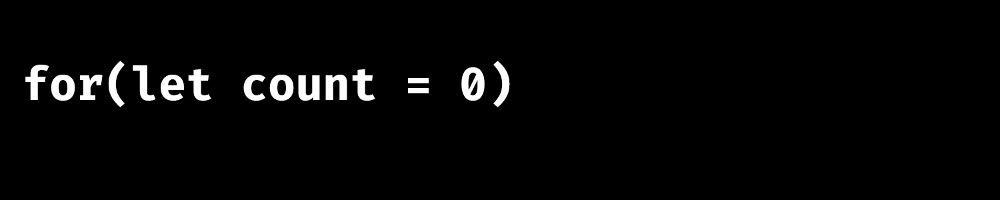
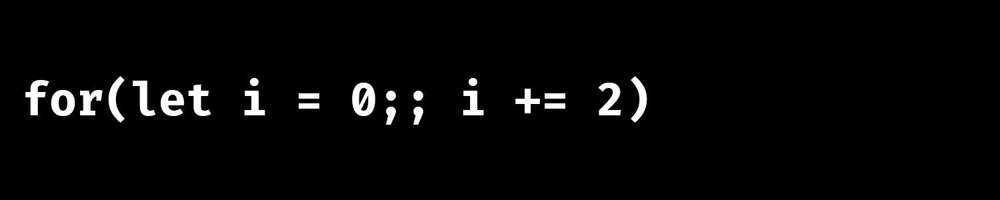
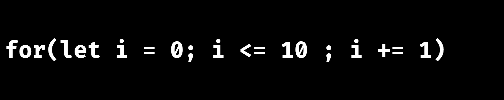
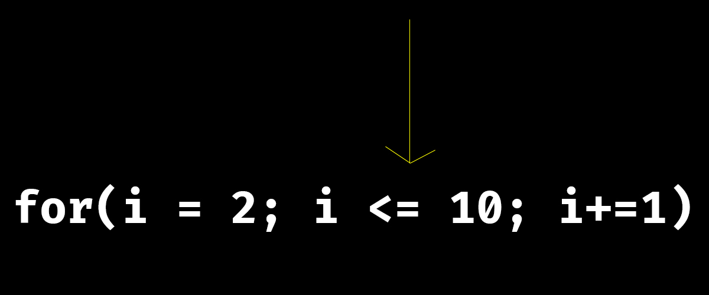

# For Loop

For loops are very simple if you have a solid mental model of the concept behind it. It is implemented in the language to make you do tasks repeatedly or over and over again. Enough talk, let's code.

```javascript
for(let i = 0; i < 5; i++) {
    let firstNum = 4;
    let secondNum = 5;
    let result = firstNum + secondNum;
    console.log(result)
}
```

After executing the code, we have a result like this
```
9
9
9
9
9
```

Alright let's explain how it's work. 

First, if you are new to *for* loop, its general structure is like this

```javascript
for(initialize; condition; after_effect) {
    // statement block
}
```
As you can see, the *for* construct basically has two parts,

1. for (initialize; condition; after_effect) and
2. { statement block }

<br> for loops consist of two parts, the **for()** and **statement block**

To avoid repetition, let's abbreviate the following

initialize = **i**

condition = **c**

after_effect = **a**

Therefore anytime I mention any of i, c or a, you should know what we are talking about.

So we can safely say the for loop consists of two parts

1. for(i; c; a)
2. { statement block }


Perhaps you ask, what is *initialize*, *condition*, and *after effect*? Hmm. I may need to defer the answer to this question till after you know how for loop works. So let's continue.

The first part of the *for* loop construct, i.e for(i;c;a) can be written in a myriad of ways, but it's mostly used to set up a counter. Now let's write one

```javascript
for(let i = 1; i <= 10; i += 10)
```

This code is not valid in javascript as it is always followed by a statement block, but for the sake of explanation, let assume it's valid. 

What the code does is count from 1 to 10.

> 1 (one)

> 2 (two)

> 3 (three)

> 4 (four)

> 5 (five)

> 6 (six)

> 7 (seven)

> 8 (eight)

> 9 (nine)

> 10 (ten)

Pretty much like the way we are taught how to count in kindergarteen.

It counts and nothing more. Simple.

But you may ask if you are really curious, how does it know where to start counting, and how does it know when to stop. Well, all the information has been given to it in the for(i; c; a) construct. Let's decode it.

First of all, we wrote


This translates to, well, "I want to count" or more formally *I want to "iterate"*.

Then we proceed to writing 


If you've been following the tutorial up to this point, then you should be familiar with this construct, 

```javascript
let i = 1;
```
Just that this time we are putting it inside a parenthesis after the *for* keyword. You know what it means right? If no, it means, 

> create a binding/identifier/variable called **i** and set it's value or point it to 1. See [variable declaration and assignments for more details](./variable-declaration-and-assignment.md)

And basically speaking, i is not mandated to be the name in a for loop, the variable can be called anything you like, you could as well write:



or even


it doesn't matter. Just give it a name and give it a value. In our example, we are giving it 1. And essentially, this is how javascript knows where to start counting. It starts counting from 1. 

But the information is not complete yet, it doesn't know in what direction it should count to. JavaScript asks, 

> Should I count forward? as in 1, 2, 3, 4, 5, 6, 7, 8, 9,  10, 11

or

> should I count backward? as in 1, 0, -1, -2, -3, -4, -5, etc

or

> should I count by adding two everytime? as in 1, 3, 5, 7, 9, 11, 13, 15

or

> should count by multiplying 2 to i? as in 1, 2, 4, 8, 16, 32, 64, etc.


And this is how we specify it, add another semicolon after that, like this
```javascript
for(let i = 1;;)
```
and specify after the semicolon like this


which means add 1 to the current value of i.

i.e i = 1 + 1 

i = 2

You can also answer it this way



which translates to add 2 to the current value of i. 

i.e i = 1 + 2


i = 3

And that is enough information to keep our for loop up and running. You've specified a starting point, which is 1 in our example, and have specified the direction you want the value of i to go. 

i.e  1, 2, 3, 4, 5, 6, 7, 8, 9, 10, 11, 12, 13, 14, 15, 16, 17, 18, 19, 20, and forever and ever more. Yes, the computer won't stop counting because we haven't told it when to stop. 

Now the last and final part, in the middle of the semicolon, we wrote i <= 10.



Hopefully you know what this code evaluates to. It essentially evaluates to *true* or *false* based on the current value of i. So basically on time before the computer counts, it checks if the condition is true or false. If it is false, it stops counting, and if it is true, it keeps counting.

Let's go through the process together.


At the beginning i = 0; 


the computer checks if the condition in the middle is true, is it true? 

i <= ( less than or equals to ) 10;

since i = 0; 

it is true; 


computer add 1 to i 

i += 1 (i = i + 1) = i = 1 + 1;

i = 2

computer keeps counting

and go back to the first statement again, but this time, things have changed, and the for loop can be said to look like this precisely


Can you spot the difference now? There is no more `let` keyword, and i is now equal to 1. Why, because 1 was added to i during the last counting or iteration. Alright. 

We continue


computer checks again if condition is true

i <= ( less than or equals to ) 10;

since i = 1;

it is true;


computer add 1 to i

i += 1, but now i is 1, so we have 

i = 1 + 1 

i = 2;


We continue at i = 2



computer checks again if condition is true

i <= ( less than or equals to ) 10;

since i = 2;

it is true;


computer add 1 to i

i += 1, but now i is 2, so we have 

i = 2 + 1 

i = 3;


We continue at i = 3


computer checks again if condition is true

i <= ( less than or equals to ) 10;

since i = 3;

it is true;


computer add 1 to i

i += 1, but now i is 3, so we have 

i = 3 + 1 

i = 4;


We continue at i = 4


computer checks again if condition is true

i <= ( less than or equals to ) 10;

since i = 4;

it is true;


computer add 1 to i

i += 1, but now i is 4, so we have 

i = 4 + 1 

i = 5;


and so on... 


and i = 9


computer checks again if condition is true

i <= ( less than or equals to ) 10;

since i = 9;

it is true;


computer add 1 to i

i += 1, but now i is 9, so we have 

i = 9 + 1 

i = 10;


We continue at i = 10


computer checks again if condition is true

i <= ( less than or equals to ) 10;

since i = 10;

it is true;


computer add 1 to i

i += 1, but now i is 10, so we have 

i = 10 + 1 

i = 11;


We continue at i = 11


computer checks again if condition is true

i <= ( less than or equals to ) 10;

since i = 11;

it is now **FALSE**; 

since i greater than 10. and arrow becomes red;

Loop stops and computer stops counting.