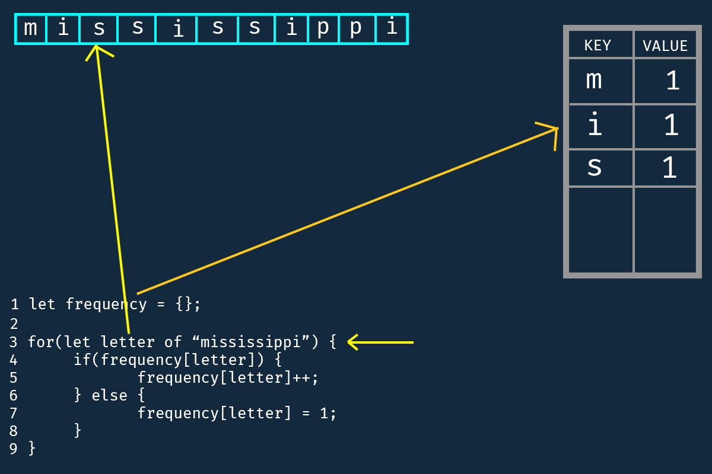
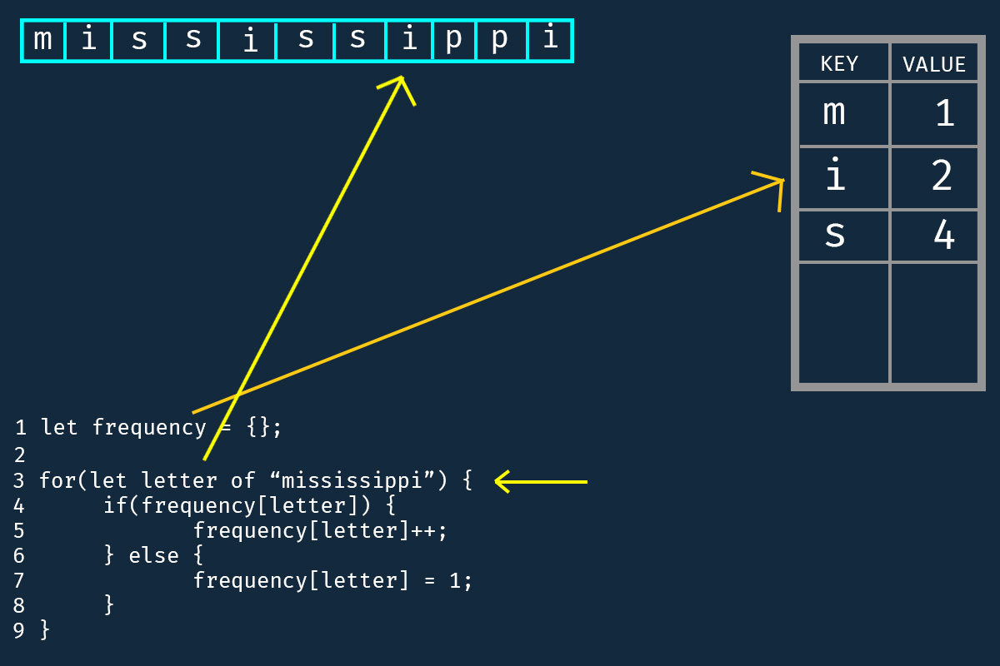
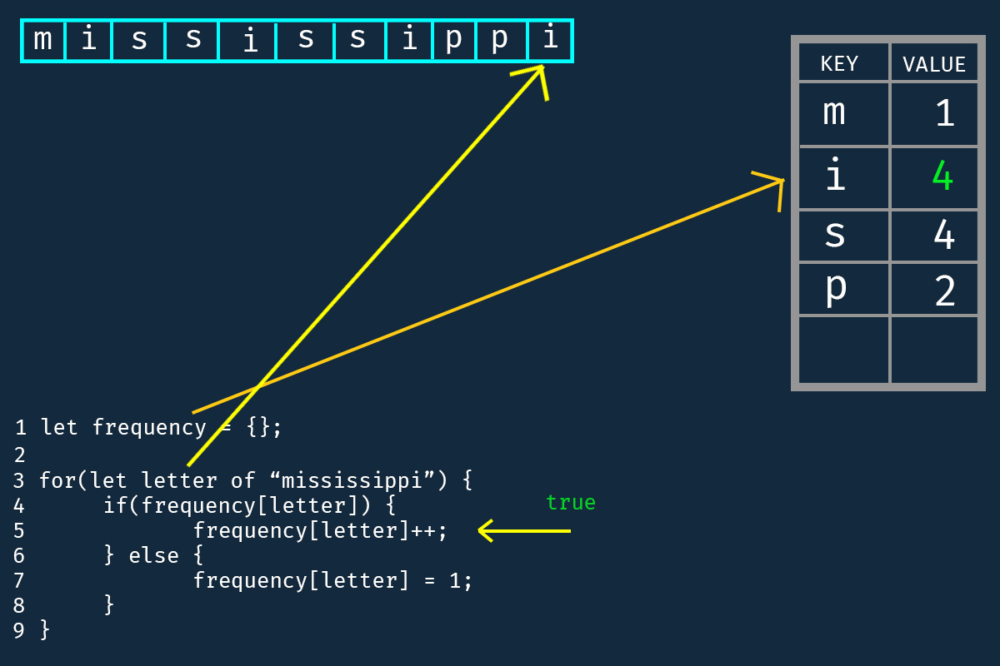

# For/of loop (2)

This section explain a more complex use case of the for/of loop.

```javascript
let frequency = {};
for(let letter of "mississippi") {
    if (frequency[letter]) {
        frequency[letter]++;
    } else {
        frequency[letter] = 1;
    }
}
```
This code is an excerpt from JavaScript, the definitive guide, page 218, *for of loop with strings*. Here we are iterating through a string, unlike in [part 1](./for-of-loop.md) where we iterate through an array. 

If you haven't forgotten the *MASS* concept, then you should already know why for/of loop works with strings. 

The code starts by initializing *frequency* to an object, and iterate through the string "mississippi". On every iteration, it checks if the current *letter* is present in the frequency object. If yes, it adds 1 to the value of *letter*, and if no, it sets the value of letter to 1.

Let's go through the iteration together.


Control enters line 1 and create a frequency binding that points to an object.


and the resultant is the image below


A new empty object is created in memory. Good. 

Now our code moves to line 2,

 

Nothing there, and control moves to line 3


Here control sees a for loop and understands immediately that it has some repetitive task to do. It reads the statement inside the parenthesis and sees the *of* keyword. Immediately, it turns "mississippi" into an array, and start iterating through it.


After conversion, the *letter* binding is set to the first value of array by default. Just like our previous example in part 1 of for/of loop. 


Then, control enters the statement block. Remember, that the letter binding is "m" at this point


On entering the statement block, at line 4, it sees an if statement. It reads the statements inside the parentheses

```javascript
if(frequency[letter])
```

This simply means *is letter present in the frequency object we created above (at line 1)*? Control checks the object:


Obviously, the frequency binding is pointing to an empty object, there is nothing like "m" inside it. Thus answer is **false**

Simple, since the answer is false, control jumps to the else block, line 7. 

Its sees a statement that indicates what to do

```javascript
frequency[letter] = 1;
```

This is basically how to set a property name in JavaScript. This simply sets "m", the ***current value of the letter binding*** as a property of the object that the frequency binding is pointing to and give it a value of 1. 


Now the frequency object is no more empty, it has one property "m", with a value of 1. 

Since line 7 has done its job, control goes back to the beginning of the loop.


Now, letter is set to point at the next element in the array, which is obviously "i".

control enters the statement block again, and start from the if statement, line 4. 


and checks if the statement is true

is the current value of "letter" in the frequency object? Can you answer that now ?

since it's no again, control jumps again to line 7


and set the current value of *letter*, which is ? well, **i**, and give it a value of 1 as well.


And after doing what we told it to do, it moves back up and continue, since we are still far from reaching the end of the loop. 

Now, letter is made to point at the next element in the array


which is "s"

and control enters the statement block again


checks the if the *if* statement evaluates to true/false

can you answer that now ?

since letter is "s"

and we don't have "s" yet in our object, then `frequency[letter]` evaluates to *false*


control jumps to the else clause, line 7 and executes the code


by setting "s" as a property of the frequency object and giving it a value of 1.


Now control go back to the beginning of the for loop



and points the letter binding to the next element, which is "s"


control enters the statement block


and checks if the statement evaluates to true

is the current value of *letter* which is "s" in the frequency object?

what is your answer? 

true! 


since it's true, control enters the if statement block, line 5, and executes the code


here we have 

```javascript
frequency[letter]++
```

which means, get the value of *letter* (which is "s") in the frequency object, and add or increment it by 1. 

since s is 1; 

then s = s + 1

s = 2; 

and s is updated to 2 in the object


and job is done, control goes back to the beginning of the loop and letter is set to the next element in the array


control enters statement block, and checks if letter (which is "i") is already in object it's true, i is already in object


control enters line 5, and repeat the operation we did earlier for "i" as well

the current value of i is fetched, which is 1

and it is increment by 1 as well

i = i + 1

i = 2

the value of i is updated to 2 as well


control goes back up to the beginning of the loop and point letter at the next element of the array


control enters the statement block

checks if the current value of letter is present in object, and since that is true,

control enters line 5, 

increment the value of "s"

s = 2 + 1

s is updated to be 3


control goes back up to the beginning of the loop and point letter at the next element of the array


control enters the statement block

checks if the current value of letter is present in object, and since that is true,

control enters line 5, 

increment the value of "s"

s = 3 + 1

s is updated to be 4


control goes back up to the beginning of the loop and point letter at the next element of the array



control enters the statement block

checks if the current value of letter is present in object, and since that is true,

control enters line 5, 

increment the value of "i"

i = 2 + 1

i is updated to be 3


control goes back up to the beginning of the loop and point letter at the next element of the array


control enters the statement block

checks if the current value of letter is present in object, and since that is false 

control enters line 7

set "p" as property of object and give it a value of 1


control goes back up to the beginning of the loop and point letter at the next element of the array


control enters the statement block

checks if the current value of letter is present in object, and since that is true,

control enters line 5, 

increment the value of "p"

p = 1 + 1

p is updated to be 2


control goes back up to the beginning of the loop and point letter at the next element of the array


control enters the statement block

checks if the current value of letter is present in object, and since that is true,

control enters line 5, 

increment the value of "i"

i = 3 + 1

i is updated to be 4



At this point, we have iterated through all the element in the string, and the for/of loop is terminated.

So if you print the result of frequency, you are going to get an object that looks like this

```javascript
console.log(frequency) 
// {m: 1, i: 4, s: 4, p: 2}
```


Hopefully, you now have a solid understanding of how for/of loop works with strings, in addtion to arrays.

To cap it all, I made a simple animation to understand better. 

https://user-images.githubusercontent.com/100664560/221962821-36f61d17-0768-4c15-ba9a-48bb313c703e.mp4


Before we talk about for/of loop with Map and Set, it would make sense to define what Map and Set is. More on that later.

#### Practice exercise

Study the following code, and answer the question that follows

```javascript
let result = "";
let word = "freeCodeCamp";

for(let i = word.length - 1; i >= 0; i--) {
    result += word[i];
}

console.log(result) // ?
```

What is the final answer of the *result* identifier. 
