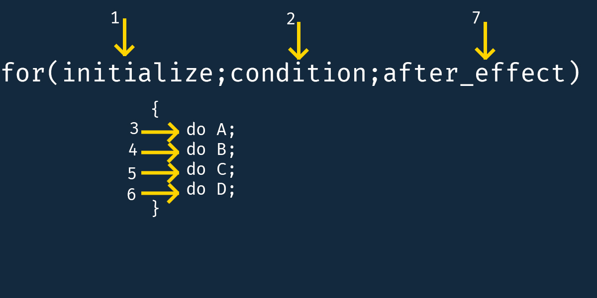

# For/of loop

For/of loop is a sibling to the regular *for loop*, and you may need to know how the for loop works before reading ahead. [Click here]() if you need to revise the **for** loop. 

So as usual, quit talking, let's code.

```javascript
let iterable = [1,2,3,4,5,6,7,8,9];

for(let element of iterable) {
    console.log(element);
}
```
Result 

```
1
2
3
4
5
6
7
8
9
```

If you understand the code, you may still want to read to the end, but if you don't understand, read to the end. 

First of all, anytime you see the **for** keyword, it essentially means we want to **iterate**. A detailed explanation of the for loop [here](). And **for/of** is a variant/subtype of the **for** loop. It essentially iterates or loops through an **ITERABLE OBJECT**. Now, we come to another question, what are *iterable objects* or how do you recognize one? 

To be honest, iterable objects are the simplest things to recognize in programming because they are not too many. They include

1) Strings
2) Arrays
3) Sets
4) Maps

You see, that's all, that's all the iterable objects(or types) we have in JavaScript. In fact, there is a mnemonic I have for it, **MASS**

M - Maps

A - Arrays

S - Strings

S - Sets

Well, I hope you are now confident with iterable objects now. Cool. 

So back to our previous definition

> for/of loop is a special kind of for loop that *only* works on any iterable object(MASS) 

So while writing for/of loops, have the iterable objects in mind, because it only works for iterable objects. 

Alright, you should already be confident with what for/of loop is and what iterable objects are, now let's get into detail how it works.

The general syntax of a for/of loop goes thus


```javascript
for(let variableName of iterableObject) {
    // do anything you like here
}

// iterable object can be a map, array, string, or set (MASS)
```
<br> for/of loop template

In a for/of loop construct we don't need any counter variable like we did in the for loop construct which looks like this



Alright, let's go through an example together.

```javascript
let ageOfStudents = [18, 17, 14, 17, 19, 20, 21, 17, 18, 19];

for(let age of ageOfStudents) {
    console.log(age);
}
```
In our sample code, we initialized ageOfStudents to an array of student ages.

Then we use the for/of loop to iterate over it...

Remember, ageOfStudent falls under the category of iterable object. Remember MASS? Alright. Let's move on.


At the beginning of the loop, we write

```javascript
for(let age of ageOfStudents) {

}
```
This essentially means that we want to iterate over the value of ageOfStudents variable and that value is an array. As seen in the diagram. 

Alright, after declaring, the loop is ready to begin. So basically, for of loop start iterating an iterable object by setting the variable you declared to the first element of the iterable object. In our array, it is clear that 18 is our first element, and therefore, age will be set to 18 by default. 


As you can see in the image above, age is pointing to 18 at the beginning of the loop. Now, control enters the statement block, and the code block is executed from top to down.


the code is executed, and the value of age which is currently 18 is printed to the console.

The loop continues and age points to the next element in the loop


age is now 17, 


control enter the statement block, the code is executed, and the value of age which is currently 17 is printed to the console.


age is now 14


control enter the statement block, the code is executed, and the value of age which is currently 17 is printed to the console.


age is now 17


control enter the statement block, the code is executed, and the value of age which is currently 17 is printed to the console.


age is now 19


control enter the statement block, the code is executed, and the value of age which is currently 19 is printed to the console.


age is now 20


control enter the statement block, the code is executed, and the value of age which is currently 20 is printed to the console.


age is now 21


control enter the statement block, the code is executed, and the value of age which is currently 21 is printed to the console.


age is now 17


control enter the statement block, the code is executed, and the value of age which is currently 17 is printed to the console.


age is now 18


control enter the statement block, the code is executed, and the value of age which is currently 18 is printed to the console.


age is now 19


control enter the statement block, the code is executed, and the value of age which is currently 19 is printed to the console.


and now age is pointing away and the for/of loop intelligently know the loop has come to an end. 

How awesome it is right? Yeah, for/of is really awesome and you might want to use next time in your code instead of the classical for loop.

