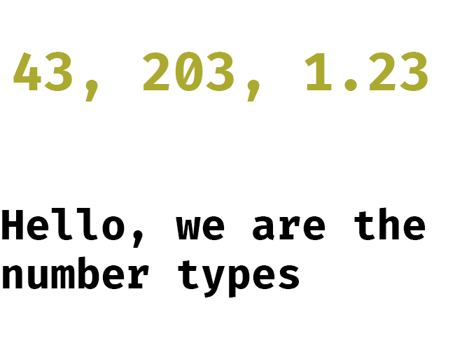
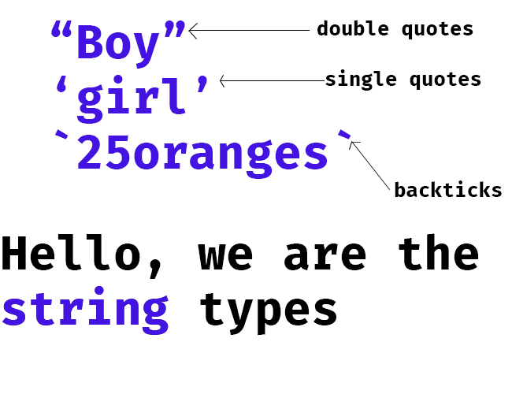
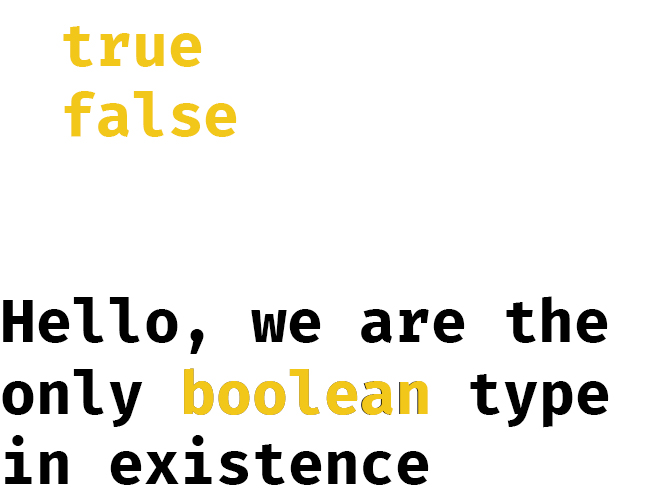
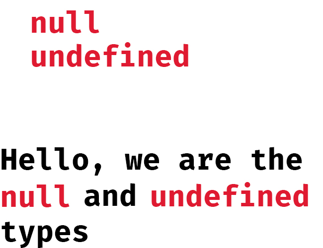
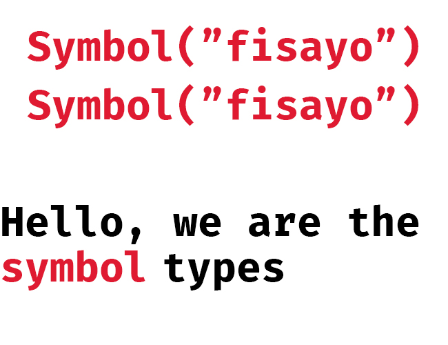
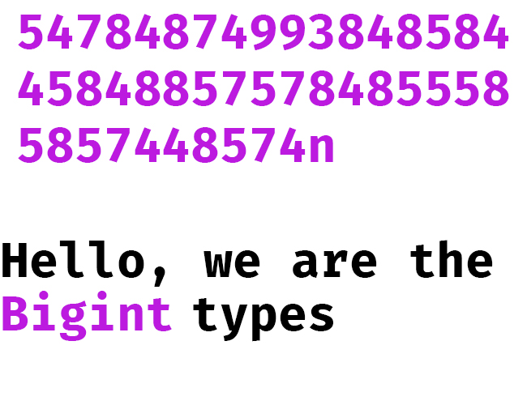

# Primitive Types

This section introduces the primitive types we mentioned in [types-and-values](./types-and-values.md)



First and foremost, we have values of the type **number** and if you run the code below, you should get a result of "number"
```javascript
console.log(typeof 45) // number
```
The number types are used for arithmetic operations as you might have guessed. Arithmetic operations such as addition, subtraction, mutliplications, division and modulus. Let's take for instance, you want to write a program that adds the population of two countries together, what you will need is the number type.

```javascript
let country1 = 2300000;
let country2 = 4350000;

console.log(country1 + country2) // 6650000
```

Easy peasy. Other situations may be when you want to count the number of clothes you have, or the amount of money you have. The number types are just numeric digits, simple. Numeric digits can be integers (whole numbers) or floating-points (decimals). 



As you can see from the image, the string types are any value encapsulated in quotaton marks, such as `""` (double quotes), `''` (single quotes) and `(``)` (backticks).

Strings are invaluable in programming. Probably want to represent the name of your country, you will need a string

```javascript
let myCountry = "Nigeria"
console.log(myCountry) // Nigeria
```
Strings can represent any textual patterns, and mind you, any digits inside any type of quote is a string and not a number.

```javascript
console.log(typeof "76") // string
```
.jpg)

We can perform an addition on strings, and this process is called *concatenation*, addition of strings together. 

```javascript
let str1 = "Hello, "
let str2 = "world!"
let result = str1 + str2;
console.log(result) // Hello, world!
console.log(typeof result) // string
```



The values *true* and *false* are the **only** members of the boolean type.

These values are used for conditional checking. Take for instance, perhaps, a friend of yours wants to organize a birthday party, but only want to invite people that are sixteen(16) years and above, we can represent such case with the code below

```javascript
let isAgeOverFifteen = true;

if(isAgeOverFifteen) { // checks if isAgeOverFifteen is true
    console.log("You are old enough to attend the party.")
} else { // if it is false
    console.log("You are too young to attend.")
}
```
You can experiment with the code above and change the value to *false* to see what will be printed. 

You can as well check the type of a value to see if it is a boolean, in our previous example, we can do something like this

```javascript
console.log(typeof isAgeOverFifteen) // boolean
```


The *null* and *undefined* are a special type in JavaScript in that they do not belong to any other data type. They are simply a type on their own. Both values represents a lack of value. For instance, you create a variable, but you don't yet know what the value will be, you can simply give it a value of *null*.

```javascript
let unknown = null;
console.log(unknown) // null
```
On the other hand, *undefined* simply represent a lack of value. This shows up more often when you are writing larger programs. So that you can understand, pay attention to the code below

```javascript
let unknown;
console.log(unknown) // undefined
```
JavaScript is a very friendly and understandable programming language that tries to read your mind. It simply sees that you assigned no value to the variable you created and simply assigned a value of undefined to it by itself. In Python, for instance, this will result in an error. You can't declare variable without assigning a value to it, but in JavaScript, you can do that freely. JavaScript will simply help you assign a value of *undefined* to it.

In other words, you can see *null* as intentional lack of value, while *undefined* as system lack of value.



The type *symbols* are recently added to JavaScript to create a non-string property names in objects. You can create one by calling the factory function `Symbol()`. It takes an optional string argument and returns a symbol. Understanding symbols properly will take some time as you will need to familiarize yourself with objects. Anyways, it is simple to say that no two symbols are equal to eachother even if they are passed the same string arguments.

```javascript
let symbol1 = Symbol("fisayo");
let symbol2 = Symbol("fisayo");
console.log(symbol1 === symbol2) // false
```



If you are coming from Python, you will be quick to realize that JavaScript is not a language for doing rigorous mathematical calculations. It lacks support for highly huge numbers like Python and so BigInt was introduced in ES2020 to support large integers. Bigint is perhaps an acronym for *Big integers*. You recognize one by its last character *n*. A sample use case might be when you want to multiply the distance of the sun to earth by the distance of andromeda galaxy to earth. 

```javascript
let distFromSunToEarth = 148110000n;
let distFromAndromedaToEarth = 24002557000000001277952n;

console.log(distFromSunToEarth * distFromAndromedaToEarth) // 3555018717270000189277470720000n
```

#### Addtional learning resource

#### Practice exercise

1. Identify the type of the following values

- "United Kingdom"
- 3456
- "67834"
- "&^384jrsld"
- "true"
- true
- false
- 567897543322223456531999999493039458589338485848383n
- Symbol("hi")
- null
- undefined

2. What is the difference between *null* and *undefined*