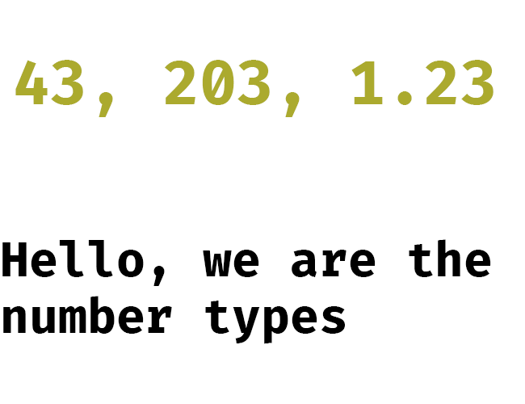
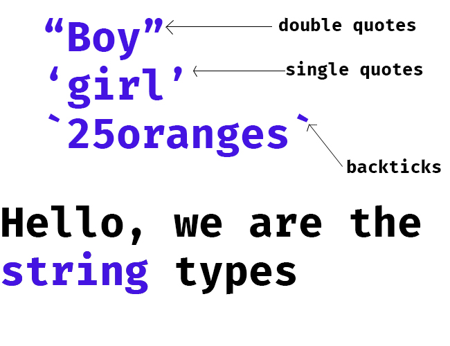
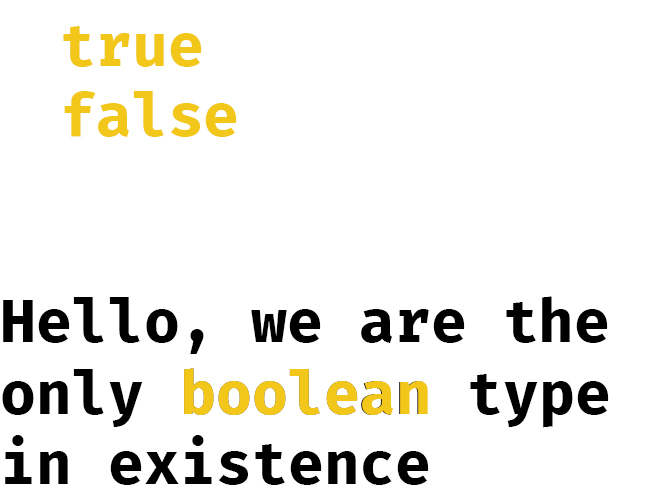
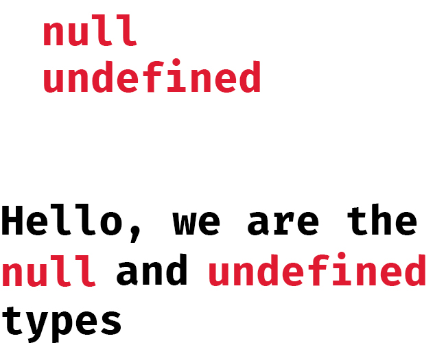
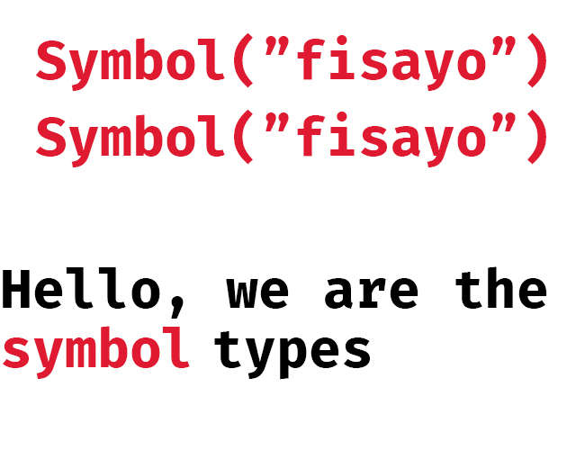
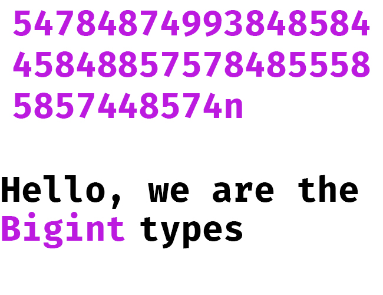

# Types and Values

> Computer programs work by manipulating **values**, such as the number 3.14 or the text 'Hello World'. <br><br> The kinds of values that can be represented and manipulated in a programming language are known as **types**. <br><br>And one of the most fundamental characteristics of a programming language is the set of types it supports. <br><br> David Flanagan, Javascript the definitive guide, seventh edition.

In the beginning we have values, then we have types. Every programming language has the set of types they support which then translates to the kinds of values it can accept to work on and manipulate. 

Before we continue, let's talk about a more familiar concept. 

In biology, animals can be classified as herbivores, carnivores, and omnivores. For the non-biology students, **herbivores** are all animals that eat plants products, **carnivores** are those that eat other animals, while **omnivores** are those that eat both. Examples include:

Herbivores : Goat, Cow, etc.

Carnivores : Lion, Tiger, Python etc

Omnivores : Humans, Chickens etc. 

What makes these *animal* differ in the *type* of food they eat? It is simply the type of *digestive system* they possess. For instance, animals that eat plant directly possess an enzyme called cellulase, which aids the digestion of cellulose. Most carnivores eat their food raw, sucking the blood as well, because they have an iron filtering digestive system, since humans lacks such iron filtering digestive system, our food must be rinsed and cooked properly before eating. It is clear now that each animal have the *types* of food they eat. Because eating just any type of food may result to death of the animal, every animal are careful in the type of food they take in. Have you ever eaten a log of plywood before? Certainly no, and that's the favorite food of termites. 
<!-- Images here as well -->
So also, each programming language (such as Python, Ruby, Perls, Java, C# etc.) has the types of values (food) they can work on (eat). Simple. So let's talk about the types of values JavaScript can *"eat"*. 

The two fundamental types in JavaScript are 

- **primitive types**
- **reference types**

Don't let the terms scare you, they are just like saying *carbohydrate* and *protein*. When you see carbohydrate, you think rice, and when you see proteins, you think meat, so when you see *primitives* think the following

- *Numbers*
- *Strings*
- *Booleans*
- *null*
- *undefined*
- *symbols* and
- *Bigint*

so also, when you see *reference*, think

- *objects*
- *arrays*
- *maps* and
- *sets*

The two fundamental difference between these two types is immutability. Primitives are immutable, while reference types are mutable. We will discuss these terms in more detail later. First let us introduces these guys properly. 



First and foremost, we have values of the type **number** and if you run the code below, you should get a result of "number"
```javascript
console.log(typeof 45) // number
```
The number types are used for arithmetic operations as you might have guessed. Arithmetic operations such as addition, subtraction, mutliplications, division and modulus. Let's take for instance, you want to write a program that adds the population of two countries together, what you will need is the number type.

```javascript
let country1 = 2300000;
let country2 = 4350000;

console.log(country1 + country2) // 6650000
```

Easy peasy. Other situations may be when you want to count the number of clothes you have, or the amount of money you have. The number types are just numeric digits, simple. Numeric digits can be integers (whole numbers) or floating-points (decimals). 



As you can see from the image, the string types are any value encapsulated in quotaton marks, such as `""` (double quotes), `''` (single quotes) and `(``)` (backticks).

Strings are invaluable in programming. Probably want to represent the name of your country, you will need a string

```javascript
let myCountry = "Nigeria"
console.log(myCountry) // Nigeria
```
Strings can represent any textual patterns, and mind you, any digits inside any type of quote is a string and not a number.

```javascript
console.log(typeof "76") // string
```
We can perform an addition on strings, and this process is called *concatenation*, addition of strings together. 

```javascript
let str1 = "Hello, "
let str2 = "world!"
let result = str1 + str2;
console.log(result) // Hello, world!
console.log(typeof result) // string
```



The values *true* and *false* are the **only** members of the boolean type.

This types are used for conditional checking. Take for instance this scenario, perhaps, a friend of yours wants to organize a birthday party, but only want to invite people that are sixteen(16) years and above, we can represent such case with the code below

```javascript
let isAgeOverEighteen = true;

if(isAgeOverEighteen) { // checks if isAgeOverEighteen is true
    console.log("You are old enough to attend the party.")
} else { // if it is false
    console.log("You are too young to attend.")
}
```
You can experiment with the code above and change the value to *false* to see what will be printed. 

You can as well check the type of a value to see if it is a boolean, in our previous example, we can do something like this

```javascript
console.log(typeof isAgeOverEighteen) // boolean
```


The *null* and *undefined* are a special type in JavaScript in that they do not belong to any other data type. They are simply a type on their own. Both values represents a lack of value. For instance, you create a variable, but you don't yet know what the value will be, you can simply give it a value of *null*. For instance,

```javascript
let unknown = null;
console.log(unknown) // null
```
On the other hand, *undefined* simply represent a lack of value. This shows up more often when you are writing larger programs. So that you can understand, pay attention to the code below

```javascript
let unknown;
console.log(unknown) // undefined
```
JavaScript is a very friendly and understandable programming language that tries to read your mind. It simply sees that you assigned no value to the variable you created and simply assigned a value of undefined to it itself. In Python, for instance, this will result in an error. You can't declare variable without assigning a value to it, but in JavaScript, you can do that freely. JavaScript will simply help you assign a value of *undefined* to it.

In other words, you can see *null* as intentional lack of value, while *undefined* as system lack of value.



The type symbols are recently added to JavaScript to create a non-string property names in objects. You can create one by calling the factory function `Symbol()`. It takes an optional string argument and returns a symbol. Understanding symbols properly will take some time as you will need to familiarize yourself with objects. Anyways, it is simple to say that no two symbols are equal to eachother even if they are passed the same string argument.

```javascript
let sym1 = Symbol("fisayo");
let sym2 = Symbol("fisayo");
console.log(sym1 === sym2) // false
```



If you are coming from Python, you will be quick to realize that JavaScript is not a language for doing rigorous mathematical calculations. It lacks support for highly huge numbers like Python and so BigInt was introduced in ES2020 to support large integers. Bigint is perhaps an acronym for Big integers. You recognize one by its last character *n*. A sample use case might be when you want calculate the distance of sun to earth and sum it to the distance of andromeda galaxy to earth. 

```javascript
let distFromSunToEarth = ;
let distFromAndromedaToEarth = ;

console.log(distFromSunToEarth + distFromAndromedaToEarth) // 
```