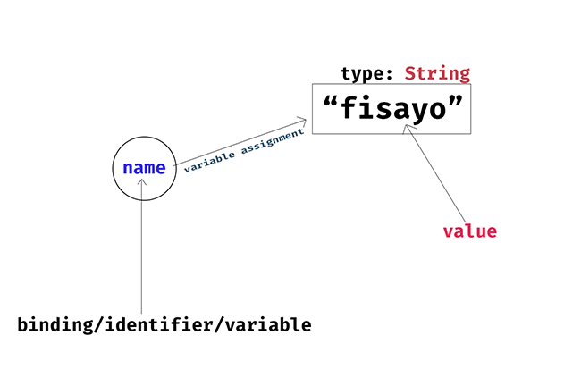

# Variable Declaration and Assignment.

> One of the fundamental techniques of *computer programming* is the use of names - or *identifiers* - to represent values. Binding a name to a value gives us a way to refer to that value and use it in the programs we write. When we do this, we typically say that we are assigning a value to a variable. The term *"variable"* implies that new values can be assigned: that the value associated with the variable may vary as our program runs. If we permanently assign a value to a name, then we call that a *constant* instead of a variable <br><br> David Flanagan: JavaScript the definitive guide


> In other words, **variables** are bindings names that can be reassigned to new values during runtime, e.g, 
```javascript
let name = "fisayo";
console.log(name); // "fisayo
// name is a "variable" that points at fisayo and can be reassigned to a new value
name = "rukayat";
console.log(name); // "rukayat"
// name has been reassigned to "rukayat"
```
The following diagrams should give you a better understading of how it works under the hood



In the diagram above, it is easy to see that our sample code creates a **name** binding that points to the value **"fisayo"** with a type of *String*

And once we **create** a variable with the *let* keyword, we bring that variable into existence in the computer memory. Meaning that the line 
```javascript
let name // is essentially telling the computer to create a new pointer in memory, 
// and uses the `=` sign to make it point to a value, like in our image above.
``` 

And if we decide to change the value in the future to something else, we can simply call the binding/variable/identifier by its name, here it is called **name**, no need to recreate it, since it already exists in memory. 

So when we run the code 
```javascript
name = "rukayat" // we don't need 'let' anymore since name already exist in memory, 
// and we are just changing what it points to. The image below should make it clear.
```


Note: You can see from the diagram that typically changing what a variable points to does not automatically delete the old value. Reasons being that *other variables may be pointing to it as well*. But when the JavaScript engine sees that no variable is pointing to such value(object), it performs an operation called ***garbage collection*** and delete those values for you automatically after some time to free up memory. In more low-level languages like C, C++ etc, you have to do this operation yourself, but in high-level languages like JS, it is done automatically by the JS engine.


```javascript
const age = 23;
console.log(age) // 23

age = 24 // error, assignment to 'constant' variable.
```


In case of the **const**, once the binding is created, it points to the value assigned to it throughout the program's lifecycle. This is to ensure consistency and avoid unwanted reassignment. 


#### Additional learning resource
- [JavaScript, the definitive guide by David flanagan](https://www.oreilly.com/library/view/javascript-the-definitive/9781491952016/), *chapter 3*, section 10 (3.10)
- [Eloquent JavaScript by Marijn Haverbeke](https://eloquentjavascript.net/02_program_structure.html) , *chapter 2*, subsections *Binding* and *Binding names*


#### Practice exercises

1. What is the major difference between *let* and *const* keywords.
2. What is *garbage collection*
3. There is a bug in the code below, fix it!
```javascript
const bestUniversityInNigeria = `University of Ibadan`;

bestUniversityInNigeria = `Obafemi Awolowo University`
```